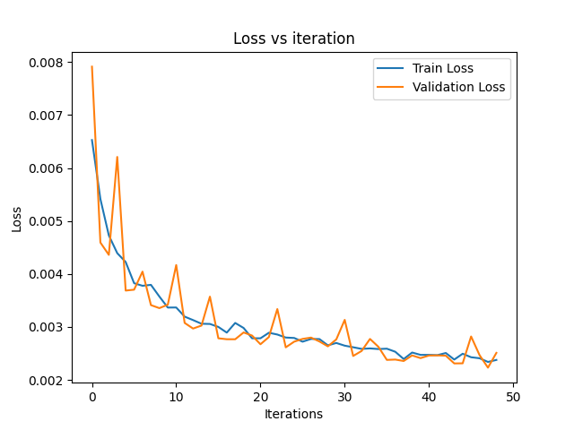
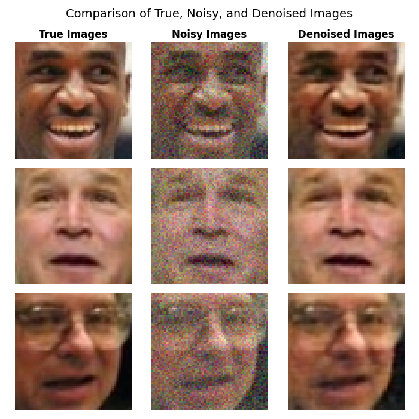

# Image Denoising Project

This project demonstrates how a Convolutional Neural Network (CNN) can effectively denoise images by removing random noise added to input images. The model is trained, validated, and tested using a cropped version of the Labeled Faces in the Wild (LFW) dataset.

---

## Features
- **Custom Dataset Class**: Loads and preprocesses images by normalizing and adding Gaussian noise.
- **CNN Architecture**: Encoder-decoder model for image denoising.
- **Training and Validation**: Tracks Mean Squared Error (MSE) during training and validation phases.
- **Test Evaluation**: Computes test loss and visualizes predictions (true, noisy, and denoised images).
- **Results Visualization**: Visualizes training logs, loss curves, and image outputs for evaluation.

---

## Directory Structure
```
Image-Denoising/
├── dataset/                  # Cropped LFW dataset directory
│   └── lfwcrop_color/        # Faces images
├── src/                      # Source code
│   ├── data.py               # Dataset class and data loader
│   ├── model.py              # CNN architecture
│   ├── train.py              # Training and validation function
│   ├── evaluation.py         # Evaluation and visualization functions
│   └── main.py               # Main script to run the project
├── requirements.txt          # Python dependencies
├── README.md                 # Project description and instructions
└── results/                  # Saved results (loss curves and predictions of the model)
```

---

## Results
### Loss Curves
Training and validation loss curves showing the convergence of the model:


### Test Set Performance
Comparison of true, noisy, and denoised images:


- **Test MSE Loss**: `0.0023`

---

## Usage

1. Clone the repository:
   ```bash
   git clone https://github.com/ahmed-turkman/Image-Denoising.git
   cd Image-Denoising
   ```

2. Install the required Python packages:
   ```bash
   pip install -r requirements.txt
   ```

3. Download and extract the LFWcrop Face Dataset into the `dataset/lfwcrop_color/` folder. You can download the dataset from [LFWcrop Face Dataset](https://conradsanderson.id.au/lfwcrop/).

4. Run the project:
   ```bash
   python src/main.py
   ```

---

## Key Components

### 1. **Dataset Loader (`data.py`)**
- Loads LFWcrop images.
- Normalizes the images and adds Gaussian noise.

### 2. **CNN Model (`model.py`)**
- Encoder-decoder architecture:
  - **Encoder**: Downsamples input features to extract high-level features.
  - **Decoder**: Upsamples features to reconstruct the denoised image.

### 3. **Training Script (`train.py`)**
- Trains the model using Mean Squared Error (MSE) loss.
- Tracks both training and validation losses.

### 4. **Evaluation Script (`evaluation.py`)**
- Plots the training vs validation MSE loss
- Computes test loss.
- Visualizes true, noisy, and denoised images.

---

## Results Folder
The `results/` folder contains:
- **Loss Curve**: `train_vs_val_loss.png`
- **Model Prediction on Three Random Samples**: `comparison_three_samples.png`

---

## Model Summary
- **Loss Function**: Mean Squared Error (MSE)
- **Optimizer**: Adam Optimizer
- **Learning Rate**: `0.001`
- **Batch Size**: `64`
- **Number of Epochs**: `50`

---

## License
This project is licensed under the MIT License. See the `LICENSE` file for more details.

---
